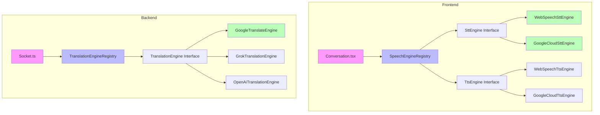

# Live Translator Codebase Patterns

**Reference**: See [`project-translator.md`](project-translator.md) for product vision, roadmap, and MVP status.

## Purpose

This document codifies the existing patterns in the Live Translator codebase so new functionality stays consistent. Follow OneProject patterns exactly as they are identical.

## Project Structure

- `apps/server`
  - Express API (TypeScript, ESM)
  - Entry: `apps/server/src/index.ts`
- `apps/web`
  - React + Vite + Tailwind + shadcn/ui
  - Entry: `apps/web/src/main.tsx`, app router: `apps/web/src/App.tsx`
- `packages/db`
  - Drizzle schema + db client
  - Schema: `packages/db/src/schema.ts`

## Backend (apps/server) Patterns

### HTTP API conventions

- Base path: all endpoints live under `/api/*`.
- Success responses: JSON object with a clear top-level key.
  - Examples:
    - `{ user: ... }`
    - `{ rooms: [...] }`
    - `{ room: ... }`
- Error responses: JSON object with top-level `error`.
  - Example: `{ error: "Invalid credentials" }`
- Validation errors (Zod): include `details`.
  - Example: `{ error: "Invalid input", details: [...] }`

### Authentication

- Auth mechanism: cookie-based JWT.
  - Cookie name: `auth_token`
  - Client must send cookies: `credentials: "include"`
- Protected endpoints must use `authenticate` middleware.
- Session model: `GET /api/me` returns `{ user: null }` when not authenticated.

### Validation (Zod)

- All request validation is done with Zod.
  - Body: `schema.parse(req.body)`
  - Query: `schema.parse(req.query)`
- Catch `ZodError` and return 400.

### Database access (Drizzle)

- DB access via `db` from `packages/db`.
- Room expiration:
  - Rooms are hard-deleted after 24 hours via a server cron job.

### Logging

- Implemented: Server logging via `apps/server/src/logger.ts`.
  - `getRequestContext(req)` enriches logs with `user` and `request` info.
  - `requestLogger` middleware (in `apps/server/src/middleware/logger.ts`) logs API activity with duration and status codes.

### Environment and configuration

- `.env` is located at repo root.
- `NODE_ENV=production` influences cookie behavior (`secure: true`).

## Frontend (apps/web) Patterns

### Routing

- Routing uses React Router.
- Private routes are gated via `ProtectedRoute` using `useAuth()`.
- Room joining is QR-first with room code fallback (no public join links).

### Auth state

- `AuthProvider` is the source of truth.
  - Uses `useQuery('me')` for reactive user state (auto-refetches on invalidations).
  - If user has `language`, it calls `i18n.changeLanguage(user.language)`.
  - Provides `user`, `isAuthenticated`, `speechEngineRegistry` (reactive to preferences).

### API access

- All network calls are implemented in `apps/web/src/lib/api.ts` via `apiClient`.
- `fetch` must use `credentials: "include"`.
- Errors:
  - Non-2xx should throw an `Error` with additional metadata `{ status, data }`.

### Server state and caching

- Use TanStack Query for all server state management.
- Server state in `apps/web/src/lib/hooks.ts` (read via `useQuery`, write via `useMutation`).
- Auth state via `AuthProvider` (uses `useQuery('me')` for reactive user data).

#### Cache Update Patterns (Critical for Race Condition Prevention)

**🚨 IMPORTANT**: Always consider timing when updating cache after mutations. Use the appropriate pattern based on what happens next:

**1. Immediate Cache Updates (for navigation-critical operations)**
```typescript
// ✅ CORRECT: When navigation immediately follows mutation
onSuccess: (data) => {
  // Update cache immediately before navigation
  queryClient.setQueryData(['rooms'], (oldData) => ({
    ...oldData,
    ...data // merge new data
  }));
  navigate('/destination'); // Navigation happens with fresh data
}
```

**2. Awaited Invalidation (for UI-dependent updates)**
```typescript
// ✅ CORRECT: When UI immediately depends on updated data
onSuccess: async () => {
  // Await invalidation to ensure UI updates with fresh data
  await queryClient.invalidateQueries({ queryKey: ['me'] });
  updateUI(); // UI updates with guaranteed fresh data
}
```

**3. Fire-and-Forget Invalidation (for non-critical updates)**
```typescript
// ✅ CORRECT: When timing doesn't matter (toasts, background updates)
onSuccess: () => {
  // Fire and forget - UI will update when query refetches
  queryClient.invalidateQueries({ queryKey: ['stats'] });
  showToast(); // Toast shows immediately
}
```

**❌ AVOID: Un-awaited invalidation before state-dependent actions**
```typescript
// ❌ WRONG: Race condition - navigation happens before cache updates
onSuccess: () => {
  queryClient.invalidateQueries({ queryKey: ['me'] }); // Async!
  navigate('/dashboard'); // Happens before cache updates - race condition!
}
```

### UI and styling

- Tailwind + shadcn-style tokens.
- Use `cn()` from `apps/web/src/lib/utils.ts`.
- UI primitives live in `apps/web/src/components/ui/*`.

### Loading & Empty States

- Skeleton, EmptyState, ErrorState components live in `apps/web/src/components/ui/*`.
  - Skeleton for loading states with customizable dimensions and animations.
    ```typescript
    // Basic usage
    <Skeleton className="h-4 w-1/2" />

    // Card skeleton
    <Skeleton className="h-32 w-full rounded-lg" />
    ```

  - EmptyState for empty data states with optional icon, title, description, and action.
    ```typescript
    // Basic empty state
    <EmptyState
      title={t('rooms.empty.title')}
      action={<Button>Create Room</Button>}
    />

    // With icon and description
    <EmptyState
      icon={Plus}
      title="No conversations found"
      description="Try adjusting your search or filters."
      action={<Button variant="outline">Clear Filters</Button>}
    />
    ```

  - ErrorState for consistent error display with retry functionality.
    ```typescript
    // With retry action
    <ErrorState
      message="Failed to load rooms"
      onRetry={() => refetch()}
    />

    // Without retry
    <ErrorState message="Network error occurred" />
    ```

  - Planned Patterns:
    - Use skeleton loaders for list views (cards/tables) during loading
    - Provide contextual empty states with clear actions (e.g., "Start New Conversation")
    - Include retry functionality for recoverable errors
    - Support i18n for all text content
    - Use responsive skeletons that match the final layout (table vs card views)

### Build

- Vite build uses Rollup `manualChunks` configuration in `apps/web/vite.config.ts` to split large vendor bundles.

### i18n

- `i18next` is initialized in `apps/web/src/lib/i18n.ts`.
- Languages supported: `en` (en-US), `zh` (cmn-CN), `it` (it-IT), `de` (de-DE), `nl` (nl-NL).

## Data model patterns

- Identifiers: `uuid` primary keys.
- Audit columns:
  - `createdAt`
  - `updatedAt` (`$onUpdate(() => sql\`now()\`)`)
  - `deletedAt` present in schema (not used for room expiration; rooms are hard-deleted after 24h).

## API response patterns

- Planned: Room list responses may include server-computed aggregate fields such as participant count and status indicators (rooms not yet implemented).

## Testing Patterns

- **Framework**: Use **Vitest** for both server and web applications.
- **Mocks**: Use `vi.mock()` for external dependencies.
- **Server Tests**: Focus on middleware, utilities, and core business logic (translation flow, room management).
- **Web Tests**: Use `@testing-library/react` for component behavior. Always mock `useAuth` when testing components that depend on authentication.
- **E2E**: Use Playwright for critical user journeys (Login, Room Creation/Join, Speech-to-Text flow).
  - Import utility functions and test their logic (e.g., Web Speech API mocks).
  - Mock database calls when testing business logic in isolation.

### Web (Vitest)

- **Tooling**: Vitest + JSDOM + `@testing-library/react`
- **Pattern**:
  - Use `vi` instead of `jest` for mocking (Vitest native).
  - Wrap components in `AuthProvider`, `BrowserRouter`, and `QueryClientProvider` if needed, or use a custom `render` helper.
  - Smoke tests (rendering) are minimum requirement for complex pages.

### E2E (Playwright)

- **Tooling**: Playwright
- **Location**: `apps/web/tests/e2e/*.spec.ts`
- **Pattern**:
  - Run against a locally running dev/test server.
  - Target critical user journeys: Login, Room Creation/Join, Real-time Translation Test.

## Engine Abstraction Pattern

The app uses a provider pattern to abstract core speech and translation functions, enabling swappable engines with minimal code changes.

### Architecture



### Core Interfaces

#### Speech Engines (Frontend)

##### SttEngine Interface
```typescript
interface SttEngine {
  initialize(config: { language: string }): Promise<void>;
  startRecognition(options: {
    onResult: (text: string, isFinal: boolean) => void;
    onError: (error: Error) => void;
  }): Promise<MediaStream>;
  stopRecognition(): Promise<void>;
  isAvailable(): boolean;
  getName(): string;
}
```

##### TtsEngine Interface
```typescript
interface TtsEngine {
  initialize(): Promise<void>;
  speak(text: string, language: string): Promise<void>;
  stop(): void;
  isAvailable(): boolean;
  getVoices(): Promise<Array<{ id: string; name: string; lang: string }>>;
  getName(): string;
}
```

#### Translation Engine (Backend)

```typescript
interface TranslationEngine {
  initialize(): Promise<void>;
  translate(params: {
    text: string;
    sourceLang: string;
    targetLang: string;
    context?: string;
  }): Promise<string>;
  isAvailable(): boolean;
  getName(): string;
  getSupportedLanguages(): Promise<Array<{ code: string; name: string }>>;
  estimateCost(text: string, sourceLang: string, targetLang: string): number;
}
```

### Engine Registries

#### SpeechEngineRegistry

Manages STT and TTS engines with user preferences and automatic fallbacks.

```typescript
class SpeechEngineRegistry {
  registerSttEngine(id: string, engine: SttEngine): void;
  registerTtsEngine(id: string, engine: TtsEngine): void;
  getSttEngine(): SttEngine;
  getTtsEngine(): TtsEngine;
  setEnginePreference(type: 'stt' | 'tts', engineId: string): void;
  getAvailableSttEngines(): Array<{id: string, name: string}>;
  getAvailableTtsEngines(): Array<{id: string, name: string}>;
}
```

#### TranslationEngineRegistry

Manages translation engines with per-user preferences.

```typescript
class TranslationEngineRegistry {
  registerEngine(id: string, engine: TranslationEngine): void;
  getEngine(userId?: string): TranslationEngine;
  setUserPreference(userId: string, engineId: string): void;
  getAvailableEngines(): Array<{id: string, name: string}>;
}
```

### Implemented Engines

#### ✅ Google Cloud STT Engine

**Status**: ✅ **COMPLETED** - Ready for production use

**Files:**
- `apps/web/src/lib/speech-engines/google-cloud-stt.ts` - Server-based STT wrapper
- `apps/server/src/services/stt.ts` - Google Cloud Speech-to-Text streaming
- `apps/server/src/socket.ts` - Server STT result emission

**Features:**
- ✅ **Server-Based Recognition** - Uses Google Cloud Speech API for reliable STT
- ✅ **Android PWA Compatible** - Works where Web Speech API fails
- ✅ **Streaming Support** - Real-time transcription with interim results
- ✅ **Automatic Fallback** - Android PWA uses server STT automatically for Web Speech API
- ✅ **User-Selectable** - Available in Profile engine preferences

#### ✅ Google Cloud TTS Engine

**Status**: ✅ **COMPLETED** - Ready for production use

**Files:**
- `apps/web/src/lib/speech-engines/google-cloud-tts.ts` - Dynamic voice fetching and selection
- `apps/web/src/lib/speech-engines/index.ts` - Engine registration
- `.env.example` - Environment variables

**Features:**
- ✅ **Dynamic Voice Fetching** - Fetches available voices from API, filters to supported languages (en-US, cmn-CN, it-IT, de-DE, nl-NL)
- ✅ **Reactive Registry** - SpeechEngineRegistry updates instantly on preference changes
- ✅ **Automatic Fallbacks** - Picks valid voices, falls back to standards if needed
- ✅ **Global Infrastructure** - Works from any location
- ✅ **High-Quality Voices** - Standard and Wavenet options
- ✅ **User-Selectable** - Available in Profile engine preferences

**Environment Variables:**
```bash
VITE_GOOGLE_CLOUD_API_KEY=your-google-cloud-api-key
GOOGLE_CLOUD_PROJECT_ID=your-google-cloud-project-id
```

### Adding New Engines

#### Example: ElevenLabs TTS Engine

#### Example: Grok Translation Engine

1. **Create the engine implementation:**
```typescript
// apps/server/src/services/translation/grok-engine.ts
import { TranslationEngine } from './translation-engine.js';

export class GrokTranslationEngine implements TranslationEngine {
  private apiKey: string;
  private baseUrl: string = 'https://api.x.ai/v1';

  constructor() {
    this.apiKey = process.env.GROK_API_KEY || '';
  }

  isAvailable(): boolean {
    return Boolean(this.apiKey);
  }

  getName(): string {
    return 'Grok (xAI)';
  }

  async initialize(): Promise<void> {
    // Verify API key
  }

  async translate(params: {
    text: string;
    sourceLang: string;
    targetLang: string;
    context?: string;
  }): Promise<string> {
    const prompt = this.buildTranslationPrompt(
      params.text,
      params.sourceLang,
      params.targetLang,
      params.context
    );

    const response = await fetch(`${this.baseUrl}/chat/completions`, {
      method: 'POST',
      headers: {
        'Authorization': `Bearer ${this.apiKey}`,
        'Content-Type': 'application/json',
      },
      body: JSON.stringify({
        model: 'grok-2-latest',
        messages: [{ role: 'user', content: prompt }],
        temperature: 0.1,
        max_tokens: 1000,
      }),
    });

    if (!response.ok) {
      throw new Error(`Grok API error: ${response.status}`);
    }

    const data = await response.json();
    return data.choices[0].message.content.trim();
  }

  private buildTranslationPrompt(
    text: string,
    sourceLang: string,
    targetLang: string,
    context?: string
  ): string {
    const languageNames = {
      en: 'English',
      zh: 'Chinese',
      it: 'Italian',
      de: 'German',
      nl: 'Dutch',
    };

    const sourceName = languageNames[sourceLang as keyof typeof languageNames] || sourceLang;
    const targetName = languageNames[targetLang as keyof typeof languageNames] || targetLang;

    let prompt = `Translate the following text from ${sourceName} to ${targetName}.\n\n`;
    prompt += `Text to translate: "${text}"\n\n`;
    prompt += `Provide ONLY the translation, no explanations or additional text.`;

    if (context) {
      prompt += `\n\nContext for better translation: ${context}`;
    }

    return prompt;
  }

  async getSupportedLanguages(): Promise<Array<{ code: string; name: string }>> {
    return [
      { code: 'en', name: 'English' },
      { code: 'zh', name: 'Chinese' },
      { code: 'it', name: 'Italian' },
      { code: 'de', name: 'German' },
      { code: 'nl', name: 'Dutch' },
    ];
  }

  estimateCost(text: string, sourceLang: string, targetLang: string): number {
    const tokenCount = Math.ceil(text.length / 4);
    return tokenCount * 0.000005; // grok-2: ~$5 per million tokens
  }
}
```

2. **Register the engine:**
```typescript
// In apps/server/src/services/translation/index.ts
import { GrokTranslationEngine } from './grok-engine.js';

translationRegistry.registerEngine('grok', new GrokTranslationEngine());
```

3. **Add environment variable:**
```bash
GROK_API_KEY=your_api_key_here
```

### Configuration

#### Environment Variables

| Variable | Description | Engine Type | Required |
|----------|-------------|-------------|----------|
| `VITE_GOOGLE_CLOUD_API_KEY` | Google Cloud TTS API key | TTS | Optional |
| `GOOGLE_CLOUD_PROJECT_ID` | Google Cloud project ID | STT/TTS/Translation | Required for Google services |

#### User Preferences

Users can select preferred engines through settings (future feature):

```typescript
// Set user preference
speechEngineRegistry.setEnginePreference('tts', 'iflytek');
translationRegistry.setUserPreference(userId, 'grok');
```

### Testing

#### Unit Tests
```typescript
// apps/web/src/lib/speech-engines/__tests__/registry.test.ts
import { describe, it, expect, vi } from 'vitest';
import { SpeechEngineRegistry } from '../registry';
import { SttEngine, TtsEngine } from '../types';

describe('SpeechEngineRegistry', () => {
  it('should register and retrieve STT engines', () => {
    const registry = new SpeechEngineRegistry();
    const mockEngine: SttEngine = {
      initialize: vi.fn(),
      startRecognition: vi.fn(),
      stopRecognition: vi.fn(),
      isAvailable: () => true,
      getName: () => 'Mock STT'
    };

    registry.registerSttEngine('mock', mockEngine);
    expect(registry.getSttEngine()).toBe(mockEngine);
  });
});
```

#### Integration Tests
```typescript
// Test engine switching
describe('Engine Switching', () => {
  it('should fallback to available engine when preferred engine fails', async () => {
    const registry = new SpeechEngineRegistry();

    // Register engines
    registry.registerTtsEngine('primary', failingEngine);
    registry.registerTtsEngine('fallback', workingEngine);

    // Set preference to failing engine
    registry.setEnginePreference('tts', 'primary');

    // Should automatically use fallback
    const engine = registry.getTtsEngine();
    expect(engine.getName()).toBe('Working TTS Engine');
  });
});
```

### Best Practices

#### Engine Implementation
1. **Always implement `isAvailable()`** - Check for API keys, browser support, etc.
2. **Handle errors gracefully** - Provide meaningful error messages
3. **Implement cost estimation** - Especially important for LLM-based engines
4. **Support context** - LLMs benefit from conversation context for better translations

#### Registry Usage
1. **Use fallbacks** - Always have a working fallback engine
2. **Cache preferences** - Store user preferences in localStorage/DB
3. **Lazy initialization** - Only initialize engines when needed
4. **Monitor performance** - Track latency and success rates

#### Error Handling
```typescript
// Always wrap engine calls with try-catch
try {
  const result = await engine.translate(params);
  return result;
} catch (error) {
  logger.error('Engine failed', { engine: engine.getName(), error });
  // Try fallback engine or return original text
  return params.text;
}
```

### Key Benefits
- **Swappable Engines**: Add new STT/TTS/Translation providers with ~50 lines of code
- **Automatic Fallbacks**: Graceful degradation when preferred engines are unavailable
- **User Preferences**: Per-user engine selection (future feature)
- **Cost Management**: Built-in cost estimation for LLM-based engines

## Pattern decisions (authoritative)

- Backend: Express + Drizzle/TDSQL-C PostgreSQL.
- Frontend: React Router + TanStack Query + shadcn/ui + Tailwind.
- Auth: httpOnly cookie JWT.
- Real-time: Socket.io (authenticated via JWT cookie).
- Translation: Google Cloud Translation (asia-east2) + Engine Abstraction Framework.
- Speech: Web Speech API (Browser) + Google Cloud Speech-to-Text (server-fallback) + Engine Abstraction Framework.
- Audio Routing: Handled by device OS; app provides toggle for TTS on/off.
- Deployment: PM2 + NGINX on Tencent Lighthouse HK.

## Refactoring Guidelines

- **Line Count Threshold**: Files reaching 500 lines of code should be evaluated for refactoring.
- **Logical Refactoring**: Do not refactor solely for the sake of line count. Refactoring should only be performed if it makes logical sense (e.g., extracting a complex sub-component, centralizing shared logic, improving testability).
- **Cleanliness**: Keep the codebase organized, but prioritize logical cohesion over strict line limits.