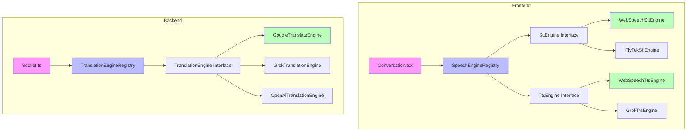

# Engine Abstraction Framework - Implementation Plan

**Status**: Planned  
**Priority**: High (enables future engine upgrades)  
**Estimated Effort**: 1-2 days  
**Risk Level**: Low (incremental refactoring)

## Overview

Implement a provider pattern framework to abstract the three core functions of the Live Translator app:
1. **Speech-to-Text (STT)** - Speech recognition
2. **Translation** - Language conversion
3. **Text-to-Speech (TTS)** - Audio output

This will allow swappable engines with minimal code changes when adding new providers (iFlyTek, Grok, OpenAI, Claude, etc.).

---

## Architecture



---

## Phase 1: Create Core Interfaces & Registries (2-3 hours)

### Files to Create:

**1. `apps/web/src/lib/speech-engines/types.ts`**
```typescript
// STT Engine Interface
export interface SttEngine {
  initialize(config: { language: string }): Promise<void>;
  startRecognition(options: {
    onResult: (text: string, isFinal: boolean) => void;
    onError: (error: Error) => void;
  }): Promise<MediaStream>;
  stopRecognition(): Promise<void>;
  isAvailable(): boolean;
  getName(): string;
}

// TTS Engine Interface
export interface TtsEngine {
  initialize(): Promise<void>;
  speak(text: string, language: string): Promise<void>;
  stop(): void;
  isAvailable(): boolean;
  getVoices(): Promise<Array<{ id: string; name: string; lang: string }>>;
  getName(): string;
}
```

**2. `apps/web/src/lib/speech-engines/registry.ts`**
```typescript
import { SttEngine, TtsEngine } from './types';

export class SpeechEngineRegistry {
  private sttEngines = new Map<string, SttEngine>();
  private ttsEngines = new Map<string, TtsEngine>();
  private userPreferences = { stt: 'web-speech-api', tts: 'web-speech-api' };

  registerSttEngine(id: string, engine: SttEngine): void {
    this.sttEngines.set(id, engine);
  }

  registerTtsEngine(id: string, engine: TtsEngine): void {
    this.ttsEngines.set(id, engine);
  }

  getSttEngine(): SttEngine {
    const engine = this.sttEngines.get(this.userPreferences.stt);
    if (!engine || !engine.isAvailable()) {
      for (const [id, fallback] of this.sttEngines) {
        if (fallback.isAvailable()) {
          console.warn(`STT engine ${this.userPreferences.stt} not available, falling back to ${id}`);
          return fallback;
        }
      }
      throw new Error('No STT engine available');
    }
    return engine;
  }

  getTtsEngine(): TtsEngine {
    const engine = this.ttsEngines.get(this.userPreferences.tts);
    if (!engine || !engine.isAvailable()) {
      for (const [id, fallback] of this.ttsEngines) {
        if (fallback.isAvailable()) {
          console.warn(`TTS engine ${this.userPreferences.tts} not available, falling back to ${id}`);
          return fallback;
        }
      }
      throw new Error('No TTS engine available');
    }
    return engine;
  }

  setEnginePreference(type: 'stt' | 'tts', engineId: string): void {
    this.userPreferences[type] = engineId;
    localStorage.setItem(`translator_${type}_engine`, engineId);
  }

  loadPreferences(): void {
    const stt = localStorage.getItem('translator_stt_engine');
    const tts = localStorage.getItem('translator_tts_engine');
    if (stt && this.sttEngines.has(stt)) this.userPreferences.stt = stt;
    if (tts && this.ttsEngines.has(tts)) this.userPreferences.tts = tts;
  }

  getAvailableSttEngines(): Array<{ id: string; name: string }> {
    return Array.from(this.sttEngines.entries())
      .filter(([_, engine]) => engine.isAvailable())
      .map(([id, engine]) => ({ id, name: engine.getName() }));
  }

  getAvailableTtsEngines(): Array<{ id: string; name: string }> {
    return Array.from(this.ttsEngines.entries())
      .filter(([_, engine]) => engine.isAvailable())
      .map(([id, engine]) => ({ id, name: engine.getName() }));
  }
}

export const speechEngineRegistry = new SpeechEngineRegistry();
```

**3. `apps/server/src/services/translation/translation-engine.ts`**
```typescript
export interface TranslationEngine {
  initialize(): Promise<void>;
  translate(params: {
    text: string;
    sourceLang: string;
    targetLang: string;
    context?: string;
  }): Promise<string>;
  isAvailable(): boolean;
  getName(): string;
  getSupportedLanguages(): Promise<Array<{ code: string; name: string }>>;
  estimateCost(text: string, sourceLang: string, targetLang: string): number;
}
```

**4. `apps/server/src/services/translation/registry.ts`**
```typescript
import { TranslationEngine } from './translation-engine';
import { logger } from '../../logger.js';

export class TranslationEngineRegistry {
  private engines = new Map<string, TranslationEngine>();
  private userPreferences = new Map<string, string>();

  registerEngine(id: string, engine: TranslationEngine): void {
    this.engines.set(id, engine);
  }

  getEngine(userId?: string): TranslationEngine {
    const preferredId = userId ? this.userPreferences.get(userId) : undefined;
    const engineId = preferredId || 'google-translate';

    const engine = this.engines.get(engineId);
    if (!engine || !engine.isAvailable()) {
      for (const [id, fallback] of this.engines) {
        if (fallback.isAvailable()) {
          logger.warn(`Translation engine ${engineId} not available, falling back to ${id}`);
          return fallback;
        }
      }
      throw new Error('No translation engine available');
    }
    return engine;
  }

  setUserPreference(userId: string, engineId: string): void {
    this.userPreferences.set(userId, engineId);
  }

  getAvailableEngines(): Array<{ id: string; name: string }> {
    return Array.from(this.engines.entries())
      .filter(([_, engine]) => engine.isAvailable())
      .map(([id, engine]) => ({ id, name: engine.getName() }));
  }
}

export const translationRegistry = new TranslationEngineRegistry();
```

---

## Phase 2: Implement Default Adapters (3-4 hours)

### Files to Create:

**5. `apps/web/src/lib/speech-engines/web-speech-stt.ts`**
```typescript
import { SttEngine } from './types';

export class WebSpeechSttEngine implements SttEngine {
  private recognition: any = null;
  private stream: MediaStream | null = null;

  isAvailable(): boolean {
    return typeof window !== 'undefined' &&
           ('webkitSpeechRecognition' in window || 'SpeechRecognition' in window);
  }

  getName(): string {
    return 'Web Speech API (Browser)';
  }

  async initialize(config: { language: string }): Promise<void> {
    const SpeechRecognition = (window as any).SpeechRecognition ||
                             (window as any).webkitSpeechRecognition;
    this.recognition = new SpeechRecognition();
    this.recognition.continuous = true;
    this.recognition.interimResults = true;
    this.recognition.lang = config.language;
  }

  async startRecognition(options: {
    onResult: (text: string, isFinal: boolean) => void;
    onError: (error: Error) => void;
  }): Promise<MediaStream> {
    this.stream = await navigator.mediaDevices.getUserMedia({ audio: true });

    this.recognition.onresult = (event: any) => {
      let finalTranscript = '';
      let interimTranscript = '';

      for (let i = event.resultIndex; i < event.results.length; i++) {
        const transcript = event.results[i][0].transcript;
        if (event.results[i].isFinal) {
          finalTranscript += transcript;
        } else {
          interimTranscript += transcript;
        }
      }

      if (finalTranscript) {
        options.onResult(finalTranscript, true);
      } else if (interimTranscript) {
        options.onResult(interimTranscript, false);
      }
    };

    this.recognition.onerror = (event: any) => {
      options.onError(new Error(event.error));
    };

    this.recognition.start();
    return this.stream;
  }

  async stopRecognition(): Promise<void> {
    if (this.recognition) {
      this.recognition.stop();
    }
    if (this.stream) {
      this.stream.getTracks().forEach(track => track.stop());
      this.stream = null;
    }
  }
}
```

**6. `apps/web/src/lib/speech-engines/web-speech-tts.ts`**
```typescript
import { TtsEngine } from './types';

export class WebSpeechTtsEngine implements TtsEngine {
  private synth: SpeechSynthesis | null = null;

  isAvailable(): boolean {
    return typeof window !== 'undefined' && 'speechSynthesis' in window;
  }

  getName(): string {
    return 'Web Speech API (Browser)';
  }

  async initialize(): Promise<void> {
    this.synth = window.speechSynthesis;
  }

  async speak(text: string, language: string): Promise<void> {
    if (!this.synth) throw new Error('TTS not initialized');

    return new Promise((resolve, reject) => {
      const utterance = new SpeechSynthesisUtterance(text);
      utterance.lang = this.getLocale(language);

      utterance.onend = () => resolve();
      utterance.onerror = (event) => reject(new Error(event.error));

      this.synth!.speak(utterance);
    });
  }

  stop(): void {
    if (this.synth) {
      this.synth.cancel();
    }
  }

  async getVoices(): Promise<Array<{ id: string; name: string; lang: string }>> {
    if (!this.synth) return [];

    return this.synth.getVoices().map(voice => ({
      id: voice.voiceURI,
      name: voice.name,
      lang: voice.lang
    }));
  }

  private getLocale(language: string): string {
    switch (language.toLowerCase()) {
      case 'zh': return 'zh-CN';
      case 'it': return 'it-IT';
      case 'de': return 'de-DE';
      case 'nl': return 'nl-NL';
      default: return 'en-US';
    }
  }
}
```

**7. `apps/server/src/services/translation/google-translate-engine.ts`**
```typescript
import { TranslationEngine } from './translation-engine';
import { TranslationServiceClient } from "@google-cloud/translate";
import { logger } from '../../logger.js';

export class GoogleTranslateEngine implements TranslationEngine {
  private client: TranslationServiceClient | null = null;
  private projectId: string;
  private location: string;

  constructor() {
    this.projectId = process.env.GOOGLE_CLOUD_PROJECT_ID || '';
    this.location = process.env.GOOGLE_CLOUD_TRANSLATE_LOCATION || 'asia-east2';
  }

  isAvailable(): boolean {
    return Boolean(this.projectId);
  }

  getName(): string {
    return 'Google Cloud Translation';
  }

  async initialize(): Promise<void> {
    this.client = new TranslationServiceClient();
  }

  async translate(params: {
    text: string;
    sourceLang: string;
    targetLang: string;
    context?: string;
  }): Promise<string> {
    if (!this.client) await this.initialize();

    const request = {
      parent: `projects/${this.projectId}/locations/${this.location}`,
      contents: [params.text.trim()],
      mimeType: "text/plain",
      sourceLanguageCode: params.sourceLang,
      targetLanguageCode: params.targetLang,
    };

    const [response] = await this.client!.translateText(request);

    if (!response.translations?.[0]?.translatedText) {
      throw new Error("No translation returned");
    }

    return response.translations[0].translatedText;
  }

  async getSupportedLanguages(): Promise<Array<{ code: string; name: string }>> {
    return [
      { code: 'en', name: 'English' },
      { code: 'zh', name: 'Chinese' },
      { code: 'it', name: 'Italian' },
      { code: 'de', name: 'German' },
      { code: 'nl', name: 'Dutch' },
    ];
  }

  estimateCost(text: string): number {
    return text.length * 0.00002;
  }
}
```

**8. `apps/web/src/lib/speech-engines/index.ts`**
```typescript
import { speechEngineRegistry } from './registry';
import { WebSpeechSttEngine } from './web-speech-stt';
import { WebSpeechTtsEngine } from './web-speech-tts';

speechEngineRegistry.registerSttEngine('web-speech-api', new WebSpeechSttEngine());
speechEngineRegistry.registerTtsEngine('web-speech-api', new WebSpeechTtsEngine());
speechEngineRegistry.loadPreferences();

export { speechEngineRegistry };
```

**9. `apps/server/src/services/translation/index.ts`**
```typescript
import { translationRegistry } from './registry';
import { GoogleTranslateEngine } from './google-translate-engine';

translationRegistry.registerEngine('google-translate', new GoogleTranslateEngine());
export { translationRegistry };
```

---

## Phase 3: Refactor Frontend - Conversation.tsx (2-3 hours)

### Files to Modify:

**10. `apps/web/src/pages/Conversation.tsx`**
- Add import: `import { speechEngineRegistry } from '@/lib/speech-engines';`
- Replace direct Web Speech API calls with engine abstraction
- Move engine instances to refs

**Key Changes:**
```typescript
// Before
const recognition = new (window as any).webkitSpeechRecognition();
recognition.continuous = true;
// ... 200+ lines of engine logic

// After
const sttEngine = useRef(speechEngineRegistry.getSttEngine());
const ttsEngine = useRef(speechEngineRegistry.getTtsEngine());

// Clean orchestration
const startRecording = async () => {
  const stream = await sttEngine.current.startRecognition({
    onResult: (text, isFinal) => {
      if (isFinal) socket.emit('speech-transcript', { text, language });
    },
    onError: (error) => toast.error(error.message)
  });
};
```

---

## Phase 4: Refactor Backend - Socket & Translation (2-3 hours)

### Files to Modify:

**11. `apps/server/src/socket.ts`**
- Add import: `import { translationRegistry } from './services/translation/index.js';`
- Replace `translateText()` calls with engine abstraction

**Key Changes:**
```typescript
// Before
const translatedText = await translateText(transcript, sourceLang, targetLang);

// After
const translationEngine = translationRegistry.getEngine(socket.userId);
const translatedText = await translationEngine.translate({
  text: transcript,
  sourceLang,
  targetLang,
  context: `Room: ${socket.roomId}`
});
```

**12. `apps/server/src/services/translation.ts`**
- Keep for backward compatibility
- Add deprecation comments
- Delegate to new engine system

---

## Phase 5: Documentation & Examples (1-2 hours)

### Files to Create:

**13. `docs/ENGINE-ABSTRACTION.md`**
- Complete guide with examples for adding new engines
- LLM translation examples (OpenAI, Claude, Grok)
- TTS examples (iFlyTek, Grok Voice)
- Configuration and environment variables

**14. Update `CODEBASE-PATTERNS.md`**
- Add "Engine Abstraction Pattern" section
- Reference new documentation

**15. Update `project-translator.md`**
- Add engine abstraction to tech stack
- Update Phase 2 roadmap with engine examples

---

## Phase 6: Testing & Verification (1 hour)

### Files to Create:

**16. `apps/web/src/lib/speech-engines/__tests__/registry.test.ts`**
```typescript
import { describe, it, expect, vi } from 'vitest';
import { SpeechEngineRegistry } from '../registry';
import { SttEngine, TtsEngine } from '../types';

describe('SpeechEngineRegistry', () => {
  it('should register and retrieve STT engines', () => {
    const registry = new SpeechEngineRegistry();
    const mockEngine: SttEngine = {
      initialize: vi.fn(),
      startRecognition: vi.fn(),
      stopRecognition: vi.fn(),
      isAvailable: () => true,
      getName: () => 'Mock STT'
    };

    registry.registerSttEngine('mock', mockEngine);
    expect(registry.getSttEngine()).toBe(mockEngine);
  });
});
```

**17. `apps/server/src/services/translation/__tests__/registry.test.ts`**
- Similar tests for translation registry

### Verification Steps:
1. Build project: `pnpm build`
2. Run tests: `pnpm test`
3. Manual test: Create room, speak, verify translation and TTS
4. Check logs for errors
5. Code review

---

## Timeline & Milestones

| Phase | Duration | Deliverable |
|-------|----------|-------------|
| Phase 1: Interfaces & Registries | 2-3 hours | Core abstraction framework |
| Phase 2: Default Adapters | 3-4 hours | Web Speech & Google Translate wrapped |
| Phase 3: Frontend Refactor | 2-3 hours | Conversation.tsx using abstraction |
| Phase 4: Backend Refactor | 2-3 hours | Socket.ts using abstraction |
| Phase 5: Documentation | 1-2 hours | Complete docs with examples |
| Phase 6: Testing | 1 hour | All tests pass, verified |
| **Total** | **11-16 hours** | **(1.5-2 days)** |

---

## Success Criteria

✅ All existing features work identically (no regressions)  
✅ New engines can be added with ~50 lines of code  
✅ Clear documentation with LLM examples  
✅ Unit tests for registries pass  
✅ No TypeScript errors, successful production build  

---

## Next Steps

1. **Approve this plan** - Confirm file structure and approach
2. **Create new files** - Phase 1 & 2 (interfaces, registries, adapters)
3. **Refactor existing code** - Phase 3 & 4 (Conversation.tsx, socket.ts)
4. **Document and test** - Phase 5 & 6

**Ready to implement?** This plan provides the complete roadmap for abstracting the three core functions while maintaining backward compatibility.
