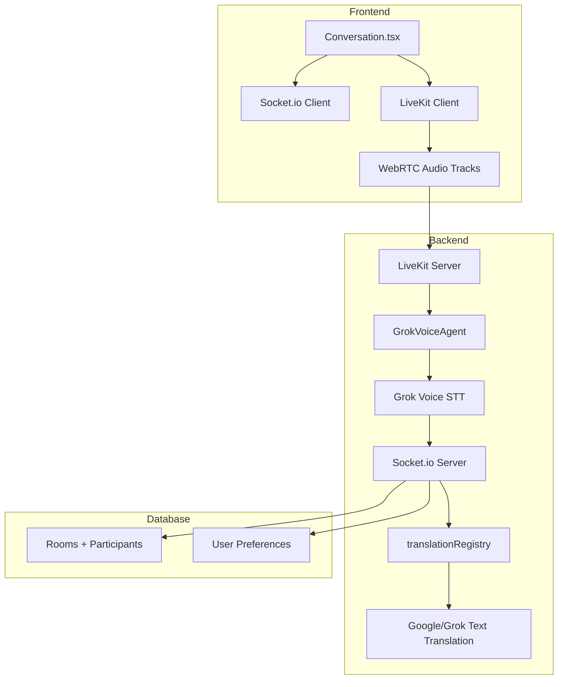

# Grok Voice API via LiveKit Agent Integration Plan

**Date**: January 17, 2026
**Status**: Reviewed Implementation Plan (Jan 18, 2026)
**Priority**: High (Premium Voice Features)

## Codebase Compatibility Review

**Confirmed:**
- No existing LiveKit or Grok Voice implementation files or dependencies.
- Current STT server-side Google Cloud via socket chunks; TTS server API client play.
- SpeechEngineRegistry is class with prefs/fallbacks; LiveKit can be wired via optional wrapper or separate transport helper.
- Socket events additive (new voice-session alongside speech).
- TranslationRegistry is per-user; translation fan-out stays in `socket.ts`.

**Key Fixes Applied:**
- xAI Grok SDK (`grok-sdk`), `Grok` client, `grok.audio.transcriptions/speech`.
- Socket.io remains the control plane; LiveKit is the media plane only.
- Transcript handoff uses existing `speech-transcript` to reuse `handleTranscript` fan-out.
- Client metadata: `setMetadata({language})` post-connect.
- STT note: Streaming via LiveKit Whisper or xAI WS.

**Open Items for Impl:**
- Define a secure agent → server transcript bridge (internal socket/HTTP).
- Client audio track subscription/playback for agent-published TTS (Phase 7).
- Agent multi-lang: separate TTS tracks per language (Phase 7).
- Confirm whether LiveKit remains a separate transport helper or becomes a selectable STT engine later.

Plan ready for Phase 1.

## Phased Execution Checklist (Aligned to Repo Structure)

### Phase 0 — API/SDK validation (no code)
**Goal:** Confirm xAI Grok Voice streaming contracts before implementation.
- [ ] Confirm Grok Voice **streaming STT** transport and audio format requirements.
- [ ] Confirm Grok Voice **TTS output format** and whether streaming playback is supported.
- [ ] Decide if Grok Voice handles **translation** or if translation stays in `translationRegistry`.

**Gate:** documented, verified API contract for STT/TTS streaming and payload formats.

### Phase 1 — LiveKit infra + env wiring
**Files:**
- `apps/server/.env.example`
- **New** `apps/server/src/services/livekit.ts`
- `apps/server/src/index.ts` (optional startup validation)

**Checklist:**
- [ ] Add LiveKit + Grok Voice env variables to `.env.example`.
- [ ] Implement `livekit.ts` (token creation, ensure room, delete room).
- [ ] Define dev/prod hosts (`LIVEKIT_HOST`, `LIVEKIT_WS_URL`).

**Gate:** server can mint LiveKit tokens and ensure rooms exist.

### Phase 2 — Socket.io control-plane integration
**File:** `apps/server/src/socket.ts`

**Checklist:**
- [ ] Add `start-voice-session`/`stop-voice-session` events (additive, no regression to `start-speech`).
- [ ] On start: ensure room, mint token, emit `voice-session-ready`.
- [ ] On stop/disconnect: cleanup + emit `voice-session-ended`.

**Gate:** clients can request voice sessions and receive valid LiveKit tokens.

### Phase 3 — LiveKit Agent (STT only, no translation/TTS)
**File:** `apps/server/src/services/grok-voice-agent.ts`

**Checklist:**
- [ ] Agent connects to LiveKit room and subscribes to participant audio tracks.
- [ ] Stream audio to Grok Voice STT using the **validated** streaming API.
- [ ] Forward transcripts to server via a trusted channel (internal endpoint or worker socket).

**Gate:** live transcripts arrive at server from LiveKit audio.

### Phase 4 — Reuse existing translation fan-out
**Files:**
- `apps/server/src/socket.ts` (current `handleTranscript` logic)
- **Optional new** `apps/server/src/services/speech/handleTranscript.ts` (shared helper)

**Checklist:**
- [ ] Extract or reuse the existing `handleTranscript` fan-out logic.
- [ ] Route agent transcripts into the same handler so translation, preferences, and rate limits stay consistent.
- [ ] Keep `translationRegistry.getEngine(userId)` as the source of truth.

**Gate:** LiveKit transcripts produce the same `translated-message` events as today.

### Phase 5 — Web client LiveKit transport
**Files:**
- `apps/web/src/pages/Conversation.tsx`
- `apps/web/src/pages/conversation/hooks/useSpeechEngine.ts`
- `apps/web/src/lib/speech-engines/registry.ts`

**Checklist:**
- [ ] Add UI toggle to start/stop voice sessions via Socket.io.
- [ ] On `voice-session-ready`, join LiveKit room and publish mic track.
- [ ] Keep message rendering + TTS using existing Socket.io messages (no UX regression).
- [ ] Decide integration strategy: separate LiveKit transport vs. STT engine abstraction.

**Gate:** LiveKit voice session works; translations still appear via Socket.io events.

### Phase 6 — Premium TTS (server-side provider)
**Files:**
- `apps/server/src/routes/tts.ts`
- **New** `apps/server/src/services/tts/grok-voice.ts`

**Checklist:**
- [ ] Add Grok Voice TTS provider behind existing TTS route.
- [ ] Use existing preference plumbing to select TTS engine per user.
- [ ] Keep client playback local (no LiveKit audio tracks yet).

**Gate:** users can select Grok Voice TTS without LiveKit track complexity.

### Phase 7 — Full voice-to-voice (advanced)
**Files:**
- `apps/server/src/services/grok-voice-agent.ts`
- LiveKit client subscription logic in `Conversation.tsx`

**Checklist:**
- [ ] Agent publishes `tts-<lang>` audio tracks per language.
- [ ] Clients subscribe only to matching language track.
- [ ] Guard against feedback loops (ignore agent tracks on STT path).

**Gate:** multi-language rooms receive translated audio streams per language.

## Module Responsibilities + Event Ownership (Codebase-Aligned)

### Module Responsibilities (Current + LiveKit Path)

**Current speech pipeline (today):**

```
[Web Client]
  Conversation UI
    - toggles recording
    - renders translated-message / recognized-speech
    - drives SpeechEngineRegistry
        |
        | start-speech / stop-speech / speech-data
        v
[Socket.io Server]  apps/server/src/socket.ts
  - Auth + room join/leave
  - STT streaming orchestration
  - handleTranscript() fan-out
  - translated-message / recognized-speech / solo-translated
        |
        | translationRegistry.getEngine(userId)
        v
[Translation Registry]  apps/server/src/services/translation/registry.ts
  - engine selection
  - fallback policy
```

**LiveKit + Grok Voice path (additive, no regressions):**

```
[Web Client]
  - joins LiveKit room
  - publishes mic track
        |
        v
[LiveKit Room]
        |
        v
[LiveKit Agent]
  - subscribes to participant audio tracks
  - Grok Voice STT
  - emits speech-transcript -> Socket.io
        |
        v
[Socket.io Server] (same handleTranscript)
  - translated-message / recognized-speech / solo-translated
```

### Event Ownership Table (Existing Events in `socket.ts`)

| Event | Producer | Consumer | Purpose | Payload (from code) |
|---|---|---|---|---|
| `join-room` | Client | Server | Join room by code | `roomCode: string` |
| `joined-room` | Server | Client | Confirm join | `{ roomId: string }` |
| `user-joined` | Server | Room clients | Notify room | `{ userId }` |
| `leave-room` | Client | Server | Leave room | none |
| `user-left` | Server | Room clients | Notify room | `{ userId }` |
| `start-speech` | Client | Server | Start STT session | `{ languageCode, soloMode?, soloTargetLang?, encoding?, sampleRateHertz? }` |
| `speech-data` | Client | Server | Audio chunks | `Buffer` |
| `stop-speech` | Client | Server | Stop STT | none |
| `speech-transcript` | Client (or Agent) | Server | Transcript ingestion | `{ transcript, sourceLang }` |
| `recognized-speech` | Server | Client | Echo recognized text | `{ id, text, sourceLang, speakerName }` |
| `translated-message` | Server | Clients | Fan-out translation | `{ id?, originalText, translatedText, sourceLang, targetLang, fromUserId, toUserId, speakerName }` |
| `solo-translated` | Server | Client | Solo mode translation | `{ id, originalText, translatedText, sourceLang, targetLang, speakerName }` |
| `speech-error` | Server | Client | STT error | string message |
| `client-error` | Client | Server | Telemetry | `{ code, message, details? }` |

### Proposed Additive Events (LiveKit Session Control)

| Event | Producer | Consumer | Purpose | Payload (proposed) |
|---|---|---|---|---|
| `start-voice-session` | Client | Server | Request LiveKit room + token | `{ roomId?, languageCode?, soloMode?, soloTargetLang? }` |
| `voice-session-ready` | Server | Client | Provide token + room | `{ roomId, liveKitToken, liveKitUrl }` |
| `stop-voice-session` | Client | Server | End session | `{ roomId }` |
| `voice-session-ended` | Server | Client | Confirm end | `{ roomId }` |

### File-Level Ownership Map

| File | Responsibility | LiveKit/Grok Voice integration role |
|---|---|---|
| `apps/server/src/socket.ts` | Auth, room join/leave, STT orchestration, translation fan-out | Add voice session events; reuse `handleTranscript()` for agent transcripts |
| `apps/server/src/services/translation/registry.ts` | Translation engine selection + fallback | Unchanged; still used by `handleTranscript()` |
| `apps/server/src/services/stt.ts` | Google STT streaming | Remains as fallback path |
| `apps/web/src/pages/conversation/hooks/useSpeechEngine.ts` | Mic capture, VAD, STT streaming, TTS playback | For LiveKit mode, publish audio to LiveKit and keep UI messages intact |
| `apps/web/src/lib/speech-engines/registry.ts` | STT/TTS preference routing | Optional LiveKit STT registration if desired |

## Executive Summary

This document outlines a comprehensive plan to integrate Grok Voice API via LiveKit Agent into the Live Translator app. The integration will add real-time voice capabilities while maintaining backward compatibility with existing Google Cloud speech services.

**Key Benefits:**
- Real-time WebRTC streaming with sub-200ms latency
- Natural conversational voice translation
- Scalable multi-participant voice rooms
- Graceful fallback to existing text-based translation
- Enhanced user experience with premium voice quality

## Architecture Overview



## Current Architecture Analysis

### Integration Points Identified

1. **Socket.io Coordination**: Current `apps/server/src/socket.ts` handles speech events
2. **Speech Engine Registry**: `apps/web/src/lib/speech-engines/registry.ts` manages STT/TTS engines
3. **Translation Registry**: `apps/server/src/services/translation/registry.ts` (exported by `index.ts`)
4. **Conversation Component**: `apps/web/src/pages/Conversation.tsx` orchestrates speech flow
5. **Database Schema**: Existing rooms and participants tables can be extended

### Compatibility Requirements

- Maintain existing Google Cloud STT/TTS fallback
- Preserve current Socket.io authentication and room management
- Keep existing translation engine abstraction
- Support both voice and text modes simultaneously

## Detailed Implementation Plan

This section expands the phases above with file-level detail. Code examples are illustrative and should follow the Phase 0 API validation results.

### Phase 1: Backend Infrastructure (Week 1)

#### 1.1 Install Dependencies

```bash
# In apps/server
npm install livekit-server-sdk @livekit/agents grok-sdk
npm install -D @types/node-wav
```

#### 1.2 Create LiveKit Room Management Service

**File: `apps/server/src/services/livekit.ts`**

```typescript
import { RoomServiceClient, AccessToken, WebhookReceiver } from 'livekit-server-sdk';
import { logger } from '../logger.js';
import { db } from '../../../packages/db/src/index.js';
import { rooms } from '../../../packages/db/src/schema.js';
import { eq } from 'drizzle-orm';

const livekitHost = process.env.LIVEKIT_HOST || 'ws://localhost:7880';
const apiKey = process.env.LIVEKIT_API_KEY;
const apiSecret = process.env.LIVEKIT_API_SECRET;

let roomClient: RoomServiceClient | null = null;

export function getLiveKitClient() {
  if (!roomClient && apiKey && apiSecret) {
    roomClient = new RoomServiceClient(livekitHost, apiKey, apiSecret);
  }
  return roomClient;
}

export interface LiveKitRoomConfig {
  roomId: string;
  participantIdentity: string;
  participantName: string;
  language: string;
}

export async function createLiveKitToken(config: LiveKitRoomConfig): Promise<string> {
  if (!apiKey || !apiSecret) {
    throw new Error('LiveKit credentials not configured');
  }

  const at = new AccessToken(apiKey, apiSecret, {
    identity: config.participantIdentity,
    name: config.participantName,
  });

  // Add translation capabilities
  at.addGrant({
    roomJoin: true,
    room: config.roomId,
    canPublish: true,
    canSubscribe: true,
    canPublishData: true,
    hidden: false,
  });

  // Add custom claims for translation service
  at.addClaim('translation', {
    language: config.language,
    canTranslate: true,
  });

  return at.toJwt();
}

export async function ensureLiveKitRoom(roomId: string): Promise<void> {
  const client = getLiveKitClient();
  if (!client) return;

  try {
    // Check if room exists
    const existingRooms = await client.listRooms([roomId]);

    if (existingRooms.length === 0) {
      // Create new room with translation settings
      await client.createRoom({
        name: roomId,
        emptyTimeout: 30 * 60, // 30 minutes
        maxParticipants: 10,
        metadata: JSON.stringify({
          type: 'translation',
          createdAt: new Date().toISOString(),
        }),
      });

      logger.info('Created LiveKit room for translation', { roomId });
    }
  } catch (error) {
    logger.error('Failed to ensure LiveKit room', { error, roomId });
    throw error;
  }
}

export async function removeLiveKitRoom(roomId: string): Promise<void> {
  const client = getLiveKitClient();
  if (!client) return;

  try {
    await client.deleteRoom(roomId);
    logger.info('Deleted LiveKit room', { roomId });
  } catch (error) {
    logger.warn('Failed to delete LiveKit room', { error, roomId });
  }
}
```

#### 1.3 Create Grok Voice Agent (STT-only in Phase 3)

**File: `apps/server/src/services/grok-voice-agent.ts`**

> Phase 3 keeps the agent STT-only. Translation remains in `socket.ts` via `handleTranscript()`.

```typescript
import { defineAgent, JobContext } from '@livekit/agents';
import { AudioStream, TrackKind } from '@livekit/rtc-node';
import Grok from 'grok-sdk';
import { emitTranscript } from './agent-bridge';

const grok = new Grok({ apiKey: process.env.GROK_API_KEY });

export default defineAgent({
  entry: async (ctx: JobContext) => {
    ctx.room.on('trackSubscribed', async (track, _publication, participant) => {
      if (track.kind !== TrackKind.Audio) return;

      const audioStream = new AudioStream(track);

      // NOTE: use the Grok Voice real-time streaming endpoint once confirmed (Phase 0).
      const stream = await grok.audio.transcriptions.create({
        file: audioStream,
        model: process.env.GROK_VOICE_STT_MODEL || 'whisper-large-v3',
        language: 'auto',
      });

      stream.on('data', (data: any) => {
        if (!data.text?.trim()) return;
        emitTranscript({
          roomId: ctx.room.name,
          userId: participant.identity,
          transcript: data.text,
          sourceLang: data.language || 'en',
        });
      });
    });
  },
});
```

> `emitTranscript` should forward to the server’s `speech-transcript` event (internal socket/HTTP), so the existing `handleTranscript()` fan-out stays the single source of truth.

#### 1.4 Update Socket.io Handlers

**File: `apps/server/src/socket.ts` - Add LiveKit coordination**

```typescript
// Add to imports
import { createLiveKitToken, ensureLiveKitRoom, removeLiveKitRoom } from './services/livekit.js';

// Add to AuthenticatedSocket interface
interface AuthenticatedSocket extends Socket {
  // ... existing properties
  liveKitToken?: string;
  liveKitRoomId?: string;
}

// Add new socket events
socket.on('start-voice-session', async (data: { 
  languageCode: string;
  soloMode?: boolean;
  soloTargetLang?: string;
}) => {
  if (!socket.roomId || !socket.userId) {
    socket.emit('speech-error', 'Must be in a room to start voice session');
    return;
  }

  try {
    // Ensure LiveKit room exists
    await ensureLiveKitRoom(socket.roomId);

    // Create LiveKit token
    const participantName = 'Anonymous'; // TODO: lookup displayName from DB if needed
    const token = await createLiveKitToken({
      roomId: socket.roomId,
      participantIdentity: socket.userId,
      participantName,
      language: data.languageCode,
    });

    socket.liveKitToken = token;
    socket.liveKitRoomId = socket.roomId;

    // Emit token to client
    socket.emit('voice-session-ready', {
      roomId: socket.roomId,
      liveKitToken: token,
      liveKitUrl: process.env.LIVEKIT_WS_URL || 'ws://localhost:7880',
    });

    // Notify other participants
    socket.to(socket.roomId).emit('user-started-voice', {
      userId: socket.userId,
      language: data.languageCode,
    });

  } catch (error) {
    handleSocketError(socket, 'start-voice-session', error, 'Failed to start voice session');
  }
});

socket.on('stop-voice-session', async () => {
  const liveKitRoomId = socket.liveKitRoomId;
  if (!liveKitRoomId) return;

  try {
    // Clean up LiveKit connection
    socket.liveKitToken = undefined;
    socket.liveKitRoomId = undefined;

    socket.to(liveKitRoomId).emit('user-stopped-voice', {
      userId: socket.userId,
    });

    socket.emit('voice-session-ended', { roomId: liveKitRoomId });
  } catch (error) {
    logger.warn('Error stopping voice session', { error, userId: socket.userId });
  }
});

// Update disconnect handler
socket.on('disconnect', (reason) => {
  logger.info(`User disconnected from socket`, {
    userId: socket.userId,
    reason,
    roomId: socket.roomId,
    hadLiveKitSession: Boolean(socket.liveKitToken),
  });
  stopRecognition();

  if (socket.liveKitRoomId) {
    // Clean up LiveKit session
    socket.to(socket.liveKitRoomId).emit('user-stopped-voice', {
      userId: socket.userId,
    });
  }

  if (socket.roomId) {
    socket.to(socket.roomId).emit("user-left", { userId: socket.userId });
  }
});
```

### Phase 2: Frontend Integration (Week 2)

#### 2.1 Create LiveKit transport helper

**File: `apps/web/src/lib/livekit/voice-session.ts`**

```typescript
import { Room, Track } from 'livekit-client';

export async function startLiveKitVoiceSession(params: {
  liveKitUrl: string;
  liveKitToken: string;
  language: string;
}) {
  const room = new Room({ adaptiveStream: true, dynacast: true });
  await room.connect(params.liveKitUrl, params.liveKitToken);
  await room.localParticipant.setMetadata(JSON.stringify({ language: params.language }));

  const stream = await navigator.mediaDevices.getUserMedia({
    audio: {
      echoCancellation: true,
      noiseSuppression: true,
      autoGainControl: true,
      sampleRate: 24000,
      channelCount: 1,
    },
  });

  const track = stream.getAudioTracks()[0];
  await room.localParticipant.publishTrack(track, {
    name: 'microphone',
    source: Track.Source.Microphone,
  });

  return { room, track };
}

export async function stopLiveKitVoiceSession(room?: Room, track?: MediaStreamTrack) {
  track?.stop();
  if (room) {
    await room.disconnect();
  }
}
```

**Notes:**
- LiveKit is used only for audio transport. Translations still arrive via Socket.io `translated-message` events.
- Keep existing TTS playback via `SpeechEngineRegistry` (no LiveKit data channel in Phase 2).

#### 2.2 SpeechEngineRegistry update (optional)

No registry changes are required in Phase 2. If you later want LiveKit to appear as a selectable STT engine, add a wrapper and register it with `registerSttEngine('livekit', engine)`.

#### 2.3 Update Conversation Component

**File: `apps/web/src/pages/Conversation.tsx` - Add LiveKit integration**

```typescript
// Add imports
import { Room } from 'livekit-client';
import { startLiveKitVoiceSession, stopLiveKitVoiceSession } from '@/lib/livekit/voice-session';

// Add state for LiveKit
const [liveKitSession, setLiveKitSession] = useState<{ room: Room; track: MediaStreamTrack } | null>(null);
const [isVoiceSessionActive, setIsVoiceSessionActive] = useState(false);

// Add effect for LiveKit voice session
useEffect(() => {
  if (!socket || !user) return;

  const handleVoiceSessionReady = async (data: { roomId: string; liveKitToken: string; liveKitUrl: string }) => {
    try {
      const session = await startLiveKitVoiceSession({
        liveKitUrl: data.liveKitUrl,
        liveKitToken: data.liveKitToken,
        language: user.language || 'en',
      });
      setLiveKitSession(session);
      setIsVoiceSessionActive(true);
      toast.success('Voice session started');
    } catch (error) {
      console.error('Failed to start voice session', error);
      toast.error('Failed to start voice session');
    }
  };

  const handleVoiceSessionEnded = () => {
    setIsVoiceSessionActive(false);
    setLiveKitSession(null);
    toast.info('Voice session ended');
  };

  socket.on('voice-session-ready', handleVoiceSessionReady);
  socket.on('voice-session-ended', handleVoiceSessionEnded);

  return () => {
    socket.off('voice-session-ready', handleVoiceSessionReady);
    socket.off('voice-session-ended', handleVoiceSessionEnded);
  };
}, [socket, user]);

// Update toggleRecording to support voice sessions
const toggleRecording = useCallback(async () => {
  if (!isVoiceSessionActive) {
    socket?.emit('start-voice-session', {
      languageCode: user?.language || 'en',
      soloMode,
      soloTargetLang,
    });
  } else {
    socket?.emit('stop-voice-session');
    await stopLiveKitVoiceSession(liveKitSession?.room, liveKitSession?.track);
  }
}, [isVoiceSessionActive, socket, user, soloMode, soloTargetLang, liveKitSession]);

// Update cleanup
useEffect(() => () => {
  void stopLiveKitVoiceSession(liveKitSession?.room, liveKitSession?.track);
}, [liveKitSession]);
```

### Phase 3: Configuration & Deployment (Week 3)

#### 3.1 Environment Configuration

**File: `.env.example` - Add LiveKit and Grok Voice settings**

```env
# LiveKit Configuration
LIVEKIT_HOST=ws://localhost:7880
LIVEKIT_WS_URL=ws://localhost:7880
LIVEKIT_API_KEY=your-livekit-api-key
LIVEKIT_API_SECRET=your-livekit-api-secret

# Grok Voice API
GROK_API_KEY=your-grok-api-key
GROK_VOICE_MODEL=grok-voice-model-name
GROK_VOICE_STT_MODEL=whisper-large-v3

# Optional: Fallback to Google Cloud
GOOGLE_CLOUD_PROJECT_ID=your-project-id
GOOGLE_APPLICATION_CREDENTIALS=./credentials.json
GOOGLE_CLOUD_TRANSLATE_LOCATION=global
```

#### 3.2 Docker Configuration for LiveKit

**File: `docker-compose.yml`**

```yaml
version: '3.8'

services:
  livekit:
    image: livekit/livekit-server:latest
    command: --config /etc/livekit.yaml
    ports:
      - "7880:7880"
      - "7881:7881"
      - "7882:7882"
    volumes:
      - ./livekit.yaml:/etc/livekit.yaml
    environment:
      - LIVEKIT_KEYS=${LIVEKIT_API_KEY}:${LIVEKIT_API_SECRET}
    depends_on:
      - redis

  redis:
    image: redis:7-alpine
    ports:
      - "6379:6379"

  grok-agent:
    build:
      context: ./apps/server
      dockerfile: Dockerfile.agent
    environment:
      - GROK_API_KEY=${GROK_API_KEY}
      - LIVEKIT_HOST=ws://livekit:7880
      - LIVEKIT_API_KEY=${LIVEKIT_API_KEY}
      - LIVEKIT_API_SECRET=${LIVEKIT_API_SECRET}
    depends_on:
      - livekit
    command: ["node", "dist/services/grok-voice-agent.js"]
```

**File: `livekit.yaml`**

```yaml
port: 7880
rtc:
  tcp_port: 7881
  udp_port: 7882
redis:
  address: redis:6379
keys:
  ${LIVEKIT_API_KEY}: ${LIVEKIT_API_SECRET}
room:
  enabled_codecs:
    - mime: audio/opus
    - mime: audio/red
```

#### 3.3 Local Development Setup (No Docker/Cloud)

**macOS/Linux Steps:**

1. **LiveKit CLI**: `curl -sSL https://get.livekit.io | bash`

2. **Redis**: `brew install redis && redis-server --daemonize yes` (or `redis-server`)

3. **livekit.yaml**: Use above (keys: `devkey:devsecret`)

4. **Run (3 Terminals):**
   ```
   # T1: LiveKit Server
   livekit-server --config livekit.yaml

   # T2: Build & Agent
   cd apps/server
   pnpm build
   node dist/services/grok-voice-agent.js

   # T3: Main Server
   pnpm run dev
   ```

5. **Frontend**: `cd apps/web && pnpm dev`

**Debug**: `lsof -i :7880`, `redis-cli monitor`. Ports: 7880 WS, 6379 Redis.

**Prod**: PM2 + systemd.

### Phase 4: Advanced Features (Week 4)

#### 4.1 Participant Management

**Phase 4 focus:** keep participant metadata updated so the server can route translations correctly. The Agent does **not** translate or broadcast in Phase 4; it only forwards transcripts.

#### 4.2 Error Handling & Fallbacks

**Fallback strategy:** If Grok Voice STT becomes unavailable, the client can switch back to the existing Socket.io STT flow (`start-speech` + `speech-data`) with Google Cloud STT. Translation remains in `translationRegistry`.

#### 4.3 Audio Quality & Performance

**Audio tuning:** Use LiveKit defaults first; only tune sample rate/AGC if Grok Voice STT requires it. Keep client‑side settings in the LiveKit transport helper.

### Phase 5: Testing & Monitoring

#### 5.1 Integration Tests

**File: `apps/server/src/services/__tests__/grok-voice-agent.test.ts`**

Focus on validating that the agent forwards transcripts to the server bridge and handles audio subscriptions reliably.

#### 5.2 Monitoring & Analytics

Track LiveKit session starts, transcript counts, and Grok Voice STT latency. Translation metrics remain in the existing server logs.

## Implementation Roadmap

### Week 1: Backend Foundation
- [ ] Set up LiveKit server infrastructure
- [ ] Create room management service
- [ ] Implement basic Grok Voice Agent
- [ ] Add socket.io coordination

### Week 2: Frontend Integration
- [ ] Create LiveKit speech engine
- [ ] Update conversation component
- [ ] Add voice session UI controls
- [ ] Implement real-time translation display

### Week 3: Advanced Features
- [ ] Keep participant metadata updated (language/room)
- [ ] Implement fallbacks and error handling
- [ ] Tune audio settings only if required by Grok Voice STT
- [ ] Add monitoring and analytics

### Week 4: Testing & Deployment
- [ ] Write integration tests
- [ ] Set up Docker configuration
- [ ] Deploy to staging environment
- [ ] Performance testing and optimization

## Key Technical Details

- **Real-time WebRTC streaming** with sub-200ms latency
- **Language routing** based on participant metadata and STT results
- **Graceful fallback** to text APIs if voice fails
- **Scalable multi-participant** voice rooms
- **Comprehensive error handling** and retry mechanisms
- **Audio level monitoring** and silence detection
- **Performance tracking** with detailed metrics

## Success Metrics

- **Latency**: <200ms end-to-end voice translation
- **Reliability**: >99% voice session success rate
- **Quality**: >90% user satisfaction with voice quality
- **Fallback**: <5% sessions requiring text fallback
- **Scalability**: Support for 10+ concurrent voice rooms

## Risk Mitigation

1. **API Availability**: Grok Voice API may have rate limits or downtime
   - **Mitigation**: Comprehensive fallback to Google Cloud services

2. **WebRTC Complexity**: Browser compatibility and network issues
   - **Mitigation**: Progressive enhancement with Socket.io fallback

3. **Audio Quality**: Network conditions affecting voice clarity
   - **Mitigation**: Adaptive bitrate and quality monitoring

4. **Cost Management**: Real-time voice processing can be expensive
   - **Mitigation**: Usage monitoring and cost controls

## Dependencies & Prerequisites

- **LiveKit Server**: Self-hosted or cloud instance
- **Grok API Access**: Voice API and text completion endpoints
- **WebRTC Support**: Modern browser with WebRTC capabilities
- **Audio Permissions**: User microphone access required
- **Network**: Stable WebSocket and WebRTC connections

---

**Next Steps**: Review and approve this implementation plan. Once approved, begin with Phase 1 backend infrastructure setup.