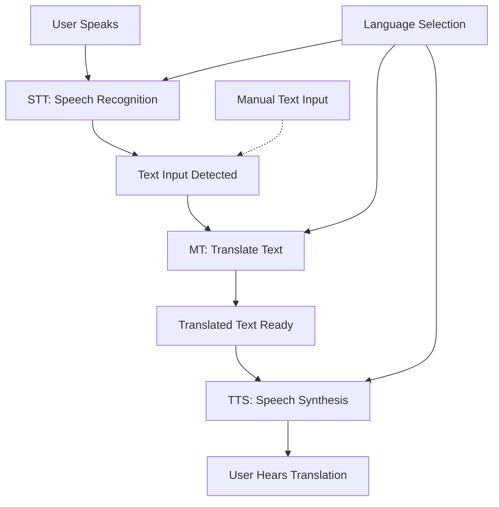
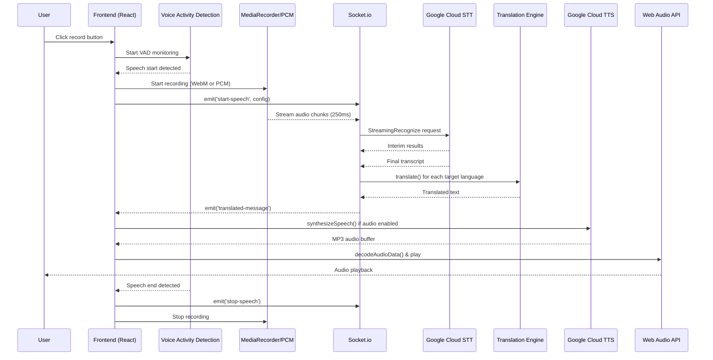

# Detailed Documentation: Implementing the 3 Pillars in TranslatorApp Webapp Frontend

The three core pillars of the TranslatorApp—**Speech-to-Text (STT)**, **Machine Translation (MT)**, and **Text-to-Speech (TTS)**—form the foundation of real-time, voice-based translation. This document details how each pillar functions in a webapp frontend implementation, leveraging modern browser APIs, external services, and best practices for performance, accessibility, and cross-browser compatibility. The implementation uses React with TypeScript, Socket.io for real-time communication, and sophisticated error handling.

## Overall Architecture Flow

The pillars integrate in a sequential pipeline:



- **Input**: Microphone access via [`navigator.mediaDevices.getUserMedia`](https://developer.mozilla.org/en-US/docs/Web/API/MediaDevices/getUserMedia).
- **Processing**: Real-time streaming via Socket.io with dual encoding support (WebM/Opus and PCM/Linear16).
- **Output**: Web Audio API playback with sophisticated queue management.
- **Error Handling**: Comprehensive retry mechanisms, rate limiting, and graceful degradation.
- **Mobile Optimization**: Push-to-talk mode, VAD (Voice Activity Detection), and platform-specific fallbacks.

### Component Architecture

```mermaid
graph TD
    A[Conversation Component] --> B[useSpeechEngine Hook]
    A --> C[SpeechEngineRegistry]
    A --> D[Socket.io Client]
    B --> E[STT Engine Interface]
    B --> F[TTS Engine Interface]
    B --> G[VAD (Voice Activity Detection)]
    B --> H[MediaRecorder / PCM Recorder]
    E --> I[Google Cloud STT]
    F --> J[Google Cloud TTS]
    D --> K[Socket.io Server]
    K --> L[STT Service]
    K --> M[Translation Service]
    K --> N[TTS Service]
```

## Pillar 1: Speech-to-Text (STT)

### How It Works
STT converts spoken language to text by recording audio with `MediaRecorder` (WebM/Opus) or `PcmRecorder` (Linear16 PCM for iOS fallback), streaming via Socket.io to backend STT service (Google Cloud Speech-to-Text), and receiving real-time transcripts. The implementation includes Voice Activity Detection (VAD) for automatic speech detection and silence handling.

### Key Implementation Details

**Dual Encoding Strategy:**
- **WebM/Opus**: Used on Android and desktop Chrome/Edge for efficient compression
- **PCM/Linear16**: Fallback for iOS Safari which doesn't support WebM in MediaRecorder
- **Dynamic Detection**: Runtime detection of MediaRecorder capabilities

**Voice Activity Detection:**
- Uses `@ricky0123/vad-react` for client-side speech detection
- Configurable thresholds for mobile vs desktop
- Automatic recording stop after silence timeout (configurable, default 10 seconds)
- Push-to-talk mode for mobile devices

**Real-time Streaming:**
- Audio chunks sent every 250ms via Socket.io
- Buffering during network interruptions (up to 10 seconds)
- Automatic reconnection and stream resumption
- Server-side recognition with interim results

### React Hook: useSpeechEngine

The actual implementation uses a comprehensive hook that manages the entire speech pipeline:

```typescript
// Located in: apps/web/src/pages/conversation/hooks/useSpeechEngine.ts

interface UseSpeechEngineProps {
  speechEngineRegistry: SpeechEngineRegistry;
  socketRef: React.MutableRefObject<Socket | null>;
  userLanguage: string | undefined;
  audioEnabled: boolean;
  soloMode: boolean;
  soloTargetLang: string;
  disableAutoStopOnSilence?: boolean;
}

export function useSpeechEngine({
  speechEngineRegistry,
  socketRef,
  userLanguage,
  audioEnabled,
  soloMode,
  soloTargetLang,
  disableAutoStopOnSilence,
}: UseSpeechEngineProps) {
  // State management for recording, STT status, TTS status
  const [isRecording, setIsRecording] = useState(false);
  const [sttStatus, setSttStatus] = useState<SttStatus>({
    isRecording: false,
    recognitionStarted: false,
    transcriptsReceived: 0,
    language: 'en-US',
  });
  
  // Refs for media streams, recorders, and VAD
  const mediaRecorderRef = useRef<MediaRecorder | null>(null);
  const pcmRecorderRef = useRef<PcmRecorder | null>(null);
  const streamRef = useRef<MediaStream | null>(null);
  const vadRef = useRef<ReturnType<typeof useMicVAD> | null>(null);
  
  // ... comprehensive implementation with error handling, retry logic, etc.
}
```

### STT Engine Interface

```typescript
// Located in: apps/web/src/lib/speech-engines/types.ts

export interface SttEngine {
  initialize(config: { language: string }): Promise<void>;
  startRecognition(options: {
    onResult: (text: string, isFinal: boolean) => void;
    onError: (error: Error) => void;
  }): Promise<MediaStream>;
  stopRecognition(): Promise<void>;
  isAvailable(): boolean;
  getName(): string;
}
```

### Google Cloud STT Implementation

```typescript
// Located in: apps/web/src/lib/speech-engines/google-cloud-stt.ts

export class GoogleCloudSttEngine implements SttEngine {
  async startRecognition(options: {
    onResult: (text: string, isFinal: boolean) => void;
    onError: (error: Error) => void;
  }): Promise<MediaStream> {
    // Get microphone access for MediaRecorder
    const stream = await navigator.mediaDevices.getUserMedia({
      audio: {
        echoCancellation: true,
        noiseSuppression: true,
        autoGainControl: true,
      },
    });

    // Return stream for MediaRecorder setup
    // Recognition results come from server via socket events
    return stream;
  }
  
  // ... other methods
}
```

### Browser Support & Platform Detection

| Platform | MediaRecorder | PCM Fallback | VAD Support | Notes |
|----------|---------------|--------------|-------------|-------|
| Android Chrome | Full (WebM/Opus) | Not needed | Full | Primary target platform |
| Desktop Chrome/Edge | Full (WebM/Opus) | Not needed | Full | Best performance |
| iOS Safari | Limited | **Required** | Full | Uses PCM recorder fallback |
| Firefox | Full (WebM/Opus) | Not needed | Full | Good support |

**Platform Detection:**
```typescript
const pushToTalkEnabled = useMemo(() => {
  if (typeof window === 'undefined') return false;
  const coarse = typeof window.matchMedia === 'function' && (
    window.matchMedia('(pointer: coarse)').matches || 
    window.matchMedia('(any-pointer: coarse)').matches
  );
  const hoverNone = typeof window.matchMedia === 'function' && (
    window.matchMedia('(hover: none)').matches || 
    window.matchMedia('(any-hover: none)').matches
  );
  return coarse && hoverNone; // True for mobile devices
}, []);
```

### Performance Optimizations

- **Chunk Size**: 250ms for low latency with network resilience
- **Buffering**: Up to 10 seconds of audio during network interruptions
- **VAD Configuration**: Mobile-optimized thresholds to prevent clipping
- **Auto-stop**: Configurable silence detection (default 10 seconds)
- **Memory Management**: Proper cleanup of AudioContext, MediaRecorder, and streams

## Pillar 2: Machine Translation (MT)

### How It Works
MT translates source text to target language using cloud APIs (Google Translate, Grok) with a registry pattern for engine selection. The backend handles translation via Socket.io events, supporting both multi-user room translation and solo mode.

### Translation Engine Registry

```typescript
// Located in: apps/server/src/services/translation/registry.ts

export class TranslationEngineRegistry {
  private engines: Map<string, TranslationEngine> = new Map();
  private userPreferences: Map<string, string> = new Map();
  
  registerEngine(id: string, engine: TranslationEngine): void {
    this.engines.set(id, engine);
  }
  
  getEngine(userId?: string): TranslationEngine {
    const preference = userId ? this.userPreferences.get(userId) : undefined;
    const engineId = preference ?? 'google-translate';
    return this.engines.get(engineId) ?? this.engines.get('google-translate')!;
  }
}
```

### Translation Flow

**Multi-user Room Translation:**
1. Speech transcript received from STT
2. Participants grouped by target language
3. Batch translation for each language group
4. Translated messages emitted to respective participants
5. Same-language participants receive original text

**Solo Mode Translation:**
1. User speaks in their language
2. Speech translated to selected target language
3. Both original and translated text displayed
4. Optional TTS playback of translation

### Supported Translation Engines

| Engine | Free Tier | Quality | Latency | Use Case |
|--------|-----------|---------|---------|----------|
| Google Translate | 500K chars/month | Excellent | Low | Primary engine |
| Grok (xAI) | Limited | Good | Medium | Alternative engine |

**Engine Configuration:**
```typescript
// Located in: apps/server/src/services/translation/index.ts

translationRegistry.registerEngine('google-translate', new GoogleTranslateEngine());
translationRegistry.registerEngine('grok-translate', new GrokTranslateEngine());
```

### Error Handling & Retry Logic

- **Exponential backoff**: 2 retries with 1-second delay
- **Partial failure handling**: Continues with other translations if one fails
- **Rate limiting**: Per-user rate limits to prevent abuse
- **Fallback**: Defaults to English on detection failures

## Pillar 3: Text-to-Speech (TTS)

### How It Works
TTS synthesizes text to speech using Google Cloud Text-to-Speech API, with audio playback via Web Audio API for precise control. The implementation includes voice management, caching, and queue handling.

### TTS Engine Interface

```typescript
// Located in: apps/web/src/lib/speech-engines/types.ts

export interface TtsEngine {
  initialize(): Promise<void>;
  speak(text: string, language: string): Promise<void>;
  stop(): void;
  isAvailable(): boolean;
  getVoices(): Promise<Array<{ id: string; name: string; lang: string }>>;
  getName(): string;
}
```

### Google Cloud TTS Implementation

```typescript
// Located in: apps/web/src/lib/speech-engines/google-cloud-tts.ts

export class GoogleCloudTtsEngine implements TtsEngine {
  private audioContext: AudioContext | null = null;
  private availableVoices: any[] = [];

  async initialize(): Promise<void> {
    if (typeof window !== 'undefined' && !this.audioContext) {
      this.audioContext = new (window.AudioContext || 
        (window as any).webkitAudioContext)();
    }
    
    // Pre-configured voice list
    this.availableVoices = [
      { name: 'en-US-Neural2-C', languageCodes: ['en-US'], ssmlGender: 'FEMALE' },
      { name: 'cmn-CN-Wavenet-A', languageCodes: ['cmn-CN'], ssmlGender: 'FEMALE' },
      // ... other voices
    ];
  }

  async speak(text: string, language: string): Promise<void> {
    if (!this.audioContext) {
      throw new Error('AudioContext not initialized');
    }

    // Resume AudioContext if suspended (browser autoplay policies)
    if (this.audioContext.state === 'suspended') {
      await this.audioContext.resume();
    }

    const voiceConfig = this.getVoiceConfig(language);
    
    // Fetch audio from backend
    const audioArrayBuffer = await apiClient.synthesizeSpeech({
      text,
      languageCode: voiceConfig.languageCode,
      voiceName: voiceConfig.voiceName,
      ssmlGender: voiceConfig.ssmlGender,
    });

    // Decode and play audio
    const audioBuffer = await this.audioContext.decodeAudioData(audioArrayBuffer);
    await this.playAudioBuffer(audioBuffer);
  }

  private async playAudioBuffer(audioBuffer: AudioBuffer): Promise<void> {
    if (!this.audioContext) return;

    const source = this.audioContext.createBufferSource();
    source.buffer = audioBuffer;
    source.connect(this.audioContext.destination);

    return new Promise((resolve) => {
      source.onended = () => resolve();
      source.start(0);
    });
  }
}
```

### Voice Selection Logic

```typescript
private getVoiceConfig(language: string): { 
  languageCode: string; 
  voiceName: string; 
  ssmlGender: string 
} {
  const langCode = this.getLanguageCode(language);
  const preferredTiers = ['Neural2', 'Wavenet', 'Standard'];

  // Prefer female voices from higher quality tiers
  const femaleVoice = preferredTiers
    .map((tier) =>
      this.availableVoices.find(
        (voice: any) =>
          voice.languageCodes.includes(langCode) &&
          voice.ssmlGender === 'FEMALE' &&
          voice.name.includes(tier)
      )
    )
    .find(Boolean);

  if (femaleVoice) {
    return {
      languageCode: langCode,
      voiceName: femaleVoice.name,
      ssmlGender: 'FEMALE',
    };
  }

  // Fallback to hardcoded defaults
  const configs: Record<string, { languageCode: string; voiceName: string; ssmlGender: string }> = {
    'en': { languageCode: 'en-US', voiceName: 'en-US-Neural2-C', ssmlGender: 'FEMALE' },
    'zh': { languageCode: 'cmn-CN', voiceName: 'cmn-CN-Wavenet-A', ssmlGender: 'FEMALE' },
    // ... other languages
  };

  return configs[language] || configs['en'];
}
```

### Backend TTS Service with Caching

```typescript
// Located in: apps/server/src/services/tts.ts

export async function synthesizeSpeech(options: TTSOptions): Promise<Buffer> {
  const cacheKey = getCacheKey(options);
  const cachePath = path.join(CACHE_DIR, `${cacheKey}.mp3`);

  // Try to serve from cache first
  try {
    const cachedAudio = await fs.readFile(cachePath);
    logger.info('Serving TTS from cache', { cacheKey });
    return cachedAudio;
  } catch {
    // Cache miss - synthesize new audio
  }

  const client = getTtsClient();
  const request = {
    input: { text: options.text },
    voice: {
      languageCode: options.languageCode,
      name: options.voiceName,
      ssmlGender: options.ssmlGender,
    },
    audioConfig: {
      audioEncoding: 'MP3' as const,
      speakingRate: 1.0,
      pitch: 0,
      volumeGainDb: 0,
    },
  };

  const [response] = await client.synthesizeSpeech(request);
  const audioBuffer = Buffer.from(response.audioContent as Uint8Array);

  // Cache asynchronously
  fs.writeFile(cachePath, audioBuffer).catch(err => {
    logger.error('Failed to save TTS to cache', { err, cacheKey });
  });

  return audioBuffer;
}
```

### TTS Status Management

```typescript
// Located in: apps/web/src/pages/conversation/types.ts

export interface TtsStatus {
  voicesCount: number;
  isSpeaking: boolean;
  voicesLoaded: boolean;
  lastAttempt?: string;
  lastError?: string;
}
```

### Playback Queue Management

The implementation handles sequential TTS playback with proper state management:

```typescript
const speakTextNow = useCallback(async (text: string, language: string | null | undefined) => {
  if (!audioEnabledRef.current) {
    setTtsStatus(prev => ({ ...prev, lastAttempt: 'Audio disabled' }));
    return;
  }

  const ttsEngine = speechEngineRegistry.getTtsEngine();
  if (!ttsEngine) {
    setTtsStatus(prev => ({ 
      ...prev, 
      lastError: 'No TTS engine available',
      lastAttempt: 'Failed - no engine' 
    }));
    return;
  }

  const locale = getTtsLocale(language);
  try {
    setTtsStatus(prev => ({ 
      ...prev, 
      isSpeaking: true, 
      lastError: undefined, 
      lastAttempt: `Speaking (${locale})` 
    }));
    
    await ttsEngine.speak(text, language || 'en');
    
    setTtsStatus(prev => ({ 
      ...prev, 
      isSpeaking: false, 
      lastError: undefined, 
      lastAttempt: `Finished (${locale})` 
    }));
  } catch (error) {
    setTtsStatus(prev => ({ 
      ...prev, 
      lastError: `Error: ${error}`, 
      isSpeaking: false, 
      lastAttempt: `Failed (${locale})` 
    }));
  }
}, [speechEngineRegistry]);
```

### Browser Support & Audio Format

| Browser | Web Audio API | MP3 Support | Notes |
|---------|---------------|-------------|-------|
| Chrome/Edge | Full | Full | Best performance |
| Firefox | Full | Full | Good support |
| Safari | Full | Full | Requires user gesture for AudioContext |
| iOS Safari | Full | Full | May require additional user interaction |

**AudioContext Management:**
- Automatic resumption on user interaction (browser autoplay policies)
- Proper cleanup on component unmount
- State tracking for suspended contexts

### Performance Optimizations

- **Server-side caching**: MD5-based caching of synthesized speech
- **Voice pre-configuration**: Hardcoded voice list to avoid API calls
- **AudioContext reuse**: Single context for all playback
- **Memory management**: Proper cleanup of audio buffers and sources
- **Error recovery**: Graceful handling of AudioContext failures

## Backend Integration

### Socket.io Architecture & Protocol Specification

The backend uses Socket.io for real-time bidirectional communication. Any client (web, Android, iOS) must implement this protocol to integrate with the translation services.

**Authentication Flow:**
1. Client obtains JWT token via REST API (`/api/auth/login`, `/api/auth/guest-login`, or `/api/auth/register`)
2. Token stored in HTTP-only cookie (`auth_token`) or sent via query parameter for non-browser clients
3. Socket.io connection established with authentication middleware
4. Server validates token and attaches `userId` to socket session

**Connection Requirements:**
```javascript
// For browser clients (cookie-based)
const socket = io(socketUrl, {
  withCredentials: true,
  transports: ['websocket', 'polling'],
});

// For mobile clients (token in query parameter)
const socket = io(socketUrl, {
  transports: ['websocket', 'polling'],
  query: {
    token: 'your-jwt-token-here'  // Alternative to cookies for mobile
  }
});
```

**Android Implementation Note:** Use a Socket.io client library like `socket.io-client-java`. Pass the JWT token in the query parameters during connection:
```java
// Android (Kotlin) example
val options = IO.Options()
options.query = "token=$jwtToken"
options.transports = arrayOf("websocket", "polling")

val socket = IO.socket("wss://api.yourapp.com", options)
socket.connect()
```

**Socket.io Middleware (Server-Side):**
```typescript
// Located in: apps/server/src/socket.ts

io.use(async (socket: AuthenticatedSocket, next) => {
  // Method 1: Cookie-based (for browsers)
  const cookies = parseCookies(socket.handshake.headers.cookie);
  const token = cookies[AUTH_COOKIE_NAME];
  
  // Method 2: Query parameter (for mobile clients)
  const tokenFromQuery = socket.handshake.query.token;
  const authToken = token || tokenFromQuery;
  
  if (!authToken) {
    return next(new Error("Authentication error: No token provided"));
  }

  try {
    const verified = jwt.verify(authToken, JWT_SECRET) as any;
    const userId = verified.userId;
    
    if (!userId) {
      return next(new Error("Authentication error: Invalid token"));
    }

    // Verify user exists in database
    const user = await db.query.users.findFirst({
      where: eq(users.id, userId),
    });
    
    if (!user) {
      return next(new Error("Authentication error: User not found"));
    }

    // Attach user info to socket
    socket.userId = userId;
    socket.userLanguage = user.language || 'en';
    
    // Set translation engine preference if available
    const preferredEngine = user.preferences?.translationEngine;
    if (preferredEngine) {
      translationRegistry.setUserPreference(userId, preferredEngine);
    }
    
    next(); // Authentication successful
  } catch (err) {
    next(new Error("Authentication error: Token verification failed"));
  }
});
```

### Key Socket Events

**Speech Recognition:**
- `start-speech`: Initialize STT stream with language config
- `speech-data`: Stream audio chunks (Buffer)
- `stop-speech`: Terminate STT stream
- `speech-transcript`: Client-side transcript submission (for hybrid approach)

**Translation:**
- `translated-message`: Multi-user room translation delivery
- `solo-translated`: Solo mode translation result
- `recognized-speech`: Original transcript echo to speaker

**Room Management:**
- `join-room`: Enter conversation room with rate limiting
- `leave-room`: Exit room and cleanup
- `user-joined` / `user-left`: Participant presence updates

### Error Handling & Resilience

**STT Error Recovery:**
```typescript
const isRecoverableSttError = (err: any) => {
  const msg = err instanceof Error ? err.message : String(err);
  if (msg.toLowerCase().includes('incomplete envelope')) return true;
  if (msg.toLowerCase().includes('connection reset by peer')) return true;
  if (msg.toLowerCase().includes('maximum allowed stream duration')) return true;
  // ... other recoverable errors
  return false;
};

const canRestartStt = () => {
  const now = Date.now();
  const windowMs = 30_000;
  const maxRestarts = 3;

  if (!socket.sttRestartWindowStartedAt || now - socket.sttRestartWindowStartedAt > windowMs) {
    socket.sttRestartWindowStartedAt = now;
    socket.sttRestartCount = 0;
  }

  const count = socket.sttRestartCount ?? 0;
  if (count >= maxRestarts) return false;

  socket.sttRestartCount = count + 1;
  return true;
};
```

**Rate Limiting:**
- Per-user rate limits for all socket events
- Configurable windows and max requests
- Graceful error messages to clients

**Retry Mechanism:**
```typescript
async function withRetry<T>(
  operation: () => Promise<T>,
  maxRetries: number = 3,
  delay: number = 1000
): Promise<T> {
  let lastError: any;

  for (let attempt = 1; attempt <= maxRetries; attempt++) {
    try {
      return await operation();
    } catch (error) {
      lastError = error;
      if (attempt < maxRetries) {
        await new Promise(resolve => setTimeout(resolve, delay * attempt));
      }
    }
  }

  throw lastError;
}
```

### Data Validation

All socket events include comprehensive validation:

```typescript
const speechStartSchema = {
  languageCode: (v: any) => typeof v === 'string' && v.length >= 2 && v.length <= 10,
  soloMode: (v: any) => typeof v === 'boolean' || v === undefined,
  soloTargetLang: (v: any) => typeof v === 'string' || v === undefined,
  encoding: (v: any) => v === undefined || v === 'WEBM_OPUS' || v === 'LINEAR16',
  sampleRateHertz: (v: any) => v === undefined || typeof v === 'number',
};

function validateSocketData(data: any, schema: { [key: string]: (value: any) => boolean }) {
  for (const [key, validator] of Object.entries(schema)) {
    if (!(key in data)) {
      if (!validator(undefined)) return false;
      continue;
    }
    if (!validator(data[key])) return false;
  }
  return true;
}
```

## i18n Support

### Language Detection & Management

**User Language Preference:**
- Stored in user profile (database)
- Updated via `PUT /api/me/language` endpoint
- Applied to STT, translation, and TTS

**Language Code Normalization:**
```typescript
const normalizeLang = (lang: string | null | undefined) => {
  const raw = (lang ?? "").trim();
  if (!raw) return "en";
  return raw.replace(/_/g, "-").split("-")[0]!.toLowerCase();
};
```

### RTL Language Support

The implementation includes RTL (Right-to-Left) language detection and handling:

```typescript
// RTL languages are detected and appropriate CSS classes applied
const RTL_LANGUAGES = ['ar', 'he', 'fa', 'ur'];

const isRTL = (langCode: string) => {
  return RTL_LANGUAGES.includes(langCode.toLowerCase());
};
```

### Dynamic UI Translations

- Uses `react-i18next` for UI localization
- JSON-based translation files in `/locales`
- Supports runtime language switching
- Fallback to English for missing keys

## Performance & Optimization

### Benchmarks

| Operation | Latency | Notes |
|-----------|---------|-------|
| STT (interim) | 100-300ms | Per utterance, network dependent |
| STT (final) | 500-1500ms | Complete sentence, network dependent |
| MT (Google) | 200-800ms | Network dependent, cached per session |
| TTS (synthesis) | 300-1000ms | First request, subsequent cached |
| TTS (playback) | <50ms | From cache, AudioContext setup |
| VAD detection | 50-100ms | Client-side, real-time |

### Optimization Strategies

**Audio Streaming:**
- 250ms chunks for optimal latency/bandwidth balance
- Buffering during network interruptions (10s capacity)
- Automatic reconnection with stream resumption
- Platform-specific encoding (WebM vs PCM)

**Translation:**
- Batch processing for multi-user rooms
- Language-based participant grouping
- Parallel translation requests
- User-specific engine preferences

**TTS:**
- Server-side caching with MD5 keys
- AudioContext reuse across utterances
- Voice pre-configuration (no runtime API calls)
- Proper resource cleanup

**Memory Management:**
- Component unmount cleanup for all streams
- AudioContext closure on page hide
- Socket connection management
- Buffer clearing on stop/recording end

### Caching Strategies

**TTS Cache:**
- File-based caching on server (`/cache/tts`)
- MD5 hash keys for content addressing
- Asynchronous cache writes
- Automatic cache growth management

**Session Storage:**
- Message history per room
- Language preferences
- UI state persistence

**Browser Caching:**
- VAD model assets (`/vad/`)
- Static assets with cache headers
- Service Worker ready (not yet implemented)

## Testing & Debugging

### Debug Panel

The implementation includes a comprehensive debug panel for development:

```typescript
// Located in: apps/web/src/pages/conversation/components/DebugPanel.tsx

interface DebugPanelProps {
  isTtsDebugEnabled: boolean;
  debugPanelExpanded: boolean;
  setDebugPanelExpanded: (expanded: boolean) => void;
  sttStatus: SttStatus;
  ttsStatus: TtsStatus;
  refreshVoices: () => Promise<void>;
}
```

**Debug Information:**
- STT status (recording, language, transcripts received)
- TTS status (voices loaded, speaking state, last attempt)
- Connection status and socket events
- Error messages with context

### Error Telemetry

Client errors are reported to the server for monitoring:

```typescript
socket.emit('client-error', {
  code: 'TTS_FAILED',
  message: error.message,
  details: { text: text.substring(0, 50), language }
});
```

**Error Categories:**
- `STT_STREAM_ERROR`: Speech recognition failures
- `TTS_FAILED`: Text-to-speech synthesis errors
- `VAD_ERROR`: Voice activity detection failures
- `RECORDING_START_FAILED`: Microphone access issues
- `CLIENT_ERROR`: General client-side errors

### Testing Utilities

**Mock Engines:**
```typescript
// Located in: apps/web/src/lib/speech-engines/mock-engines.ts

export class MockSttEngine implements SttEngine {
  // Simulated STT for testing
}

export class MockTtsEngine implements TtsEngine {
  // Simulated TTS for testing
}
```

**Test Mode:**
- Automatic mock engine registration in test mode
- No external API dependencies
- Deterministic behavior for E2E tests

## Integration & Best Practices

### Full Pipeline Example



### State Management

**Local State:**
- React `useState` for UI state (recording, audio enabled, etc.)
- `useRef` for mutable values (streams, sockets, timers)
- `useCallback` for stable function references

**Global State:**
- React Query for server state (rooms, users)
- Context providers for auth and speech engines
- URL params for room identification

**Performance Considerations:**
- Minimal re-renders with proper dependency arrays
- Refs for frequently updated values (timestamps, flags)
- Memoized computations for derived state

### Accessibility Features

- **ARIA labels**: All interactive elements have descriptive labels
- **Keyboard shortcuts**: Spacebar for push-to-talk (when enabled)
- **Visual feedback**: Recording indicators, connection status
- **Error announcements**: Screen reader accessible error messages
- **High contrast**: Supports system high contrast mode

### Security Considerations

- **HTTPS only**: Required for microphone access
- **Authentication**: JWT-based session management
- **Rate limiting**: Per-user limits on all operations
- **Input validation**: Comprehensive schema validation
- **Error sanitization**: No sensitive data in client errors

### Mobile Optimization

**Push-to-Talk Mode:**
- Automatic detection of mobile devices
- Hold-to-record instead of toggle
- Prevents accidental recording
- Better for mobile UX

**Resource Management:**
- Screen wake lock during recording
- Proper cleanup on page hide/visibility change
- Memory-efficient buffering
- Battery-conscious VAD settings

**Network Resilience:**
- Offline detection and graceful degradation
- Reconnection with state recovery
- Buffered audio during network issues
- Exponential backoff for retries

## Potential Challenges & Solutions

### Latency Management

**Challenge**: End-to-end latency from speech to translated audio

**Solutions:**
- Parallel processing (STT + MT can overlap)
- Edge-optimized encoding (Opus for Android, PCM for iOS)
- Client-side VAD reduces server processing
- Caching for repeated phrases (TTS)

### Accuracy Improvement

**Challenge**: Speech recognition errors, translation quality

**Solutions:**
- User feedback loop (edit transcripts before sending)
- Context-aware translation (room context, user preferences)
- Multiple engine support (fallback options)
- Continuous model updates (Google Cloud STT)

### Multi-language Complexity

**Challenge**: Supporting 8+ languages with different scripts, directions

**Solutions:**
- Normalized language codes (ISO 639-1)
- RTL detection and CSS handling
- Voice per language (gender-appropriate)
- Script-appropriate fonts and rendering

### Mobile Device Limitations

**Challenge**: Browser restrictions, battery life, performance

**Solutions:**
- Push-to-talk for mobile UX
- Efficient VAD configuration
- Proper resource cleanup
- Network-optimized chunking
- Background tab handling

## References

- [MediaRecorder API](https://developer.mozilla.org/en-US/docs/Web/API/MediaRecorder)
- [Web Audio API](https://developer.mozilla.org/en-US/docs/Web/API/Web_Audio_API)
- [Socket.io](https://socket.io/docs/)
- [Google Cloud Speech-to-Text](https://cloud.google.com/speech-to-text)
- [Google Cloud Text-to-Speech](https://cloud.google.com/text-to-speech)
- [VAD React](https://github.com/ricky0123/vad-react)
- [WebRTC getUserMedia](https://developer.mozilla.org/en-US/docs/Web/API/MediaDevices/getUserMedia)
- [React Hooks](https://react.dev/reference/react)
- [React Query](https://tanstack.com/query/latest)
- [Socket.io Rate Limiting](https://socket.io/docs/v4/middlewares/)